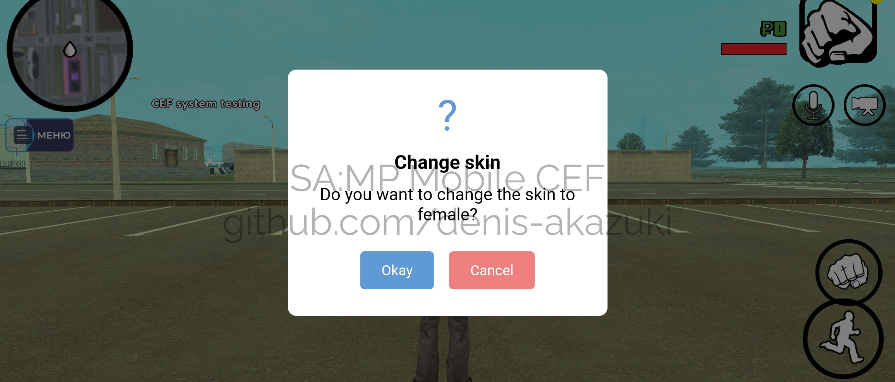
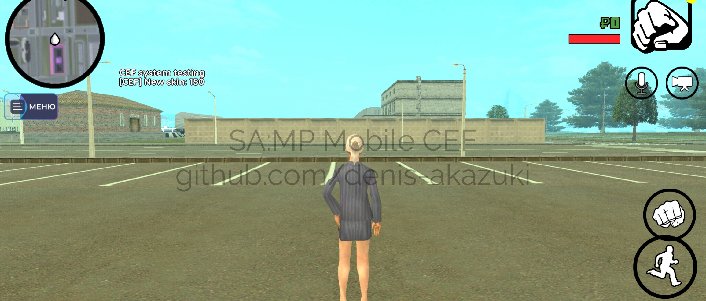

Language: **English** | [Українська](README_UK.md)

# SA:MP Mobile CEF
**Ready-made solution** for **integrating a browser** (WebView, or more commonly known as CEF) into the [**SA:MP mobile client**](https://github.com/4x11/build69). For example, it enables the integration of beautiful interfaces into the client-side using browser technologies (HTML/CSS/JS).

## Key Features
- Full control over WebView on the server side.
- Interaction between client and server: data transfer, function calls on both sides.
- Easy integration with any SA:MP mobile client and server (open.mp or standard server).

## Download and Getting Started
- To get started with this solution, you need to download the files from the [**latest released version**](https://github.com/denis-akazuki/samp-mobile-cef/releases/latest).
- Detailed documentation on connection and usage can be found here: [**client-side**](docs/en/client.md), [**server-side**](docs/en/server.md), and [**frontend-side**](docs/en/web.md).
- An example of usage can be found [**here**](example/).

## Source Code and Modification
Currently, the source code for the client-side (C++ and Java) **is not distributed** and any **modification is impossible**. All the server-side source code is available in the file `server/SAMPMobileCef.inc`, and modification of this code is allowed as long as the copyright comment is retained.

## Example of Solution Usage
A simple notification system with the ability to accept or reject an action - the server offers the player to change their skin to a female one.

---

---
**Copyright © 2024 [Denis Akazuki](https://github.com/denis-akazuki).**
